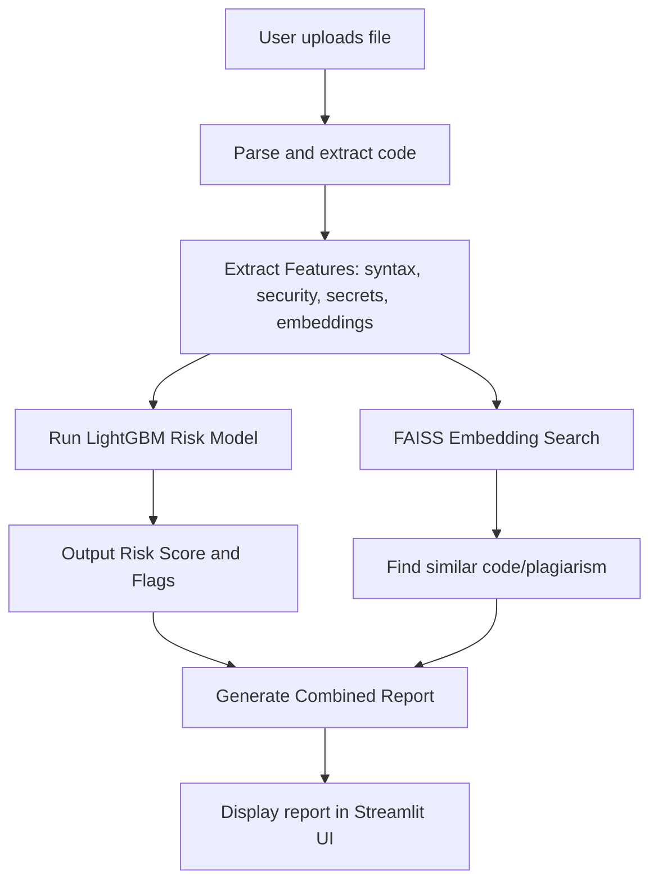

# AI-MVP: Security Risk and Plagiarism Detection using Machine Learning

## Overview

AI-MVP is a Python-based Streamlit web application designed to analyze source code for security vulnerabilities, plagiarism risks, and code quality issues.  
It leverages machine learning models, static code analysis, and code similarity indexing to provide real-time risk assessments of uploaded files.

## Features

- **Static Security Analysis**: Detect known patterns and risky code using rule-based and ML-enhanced heuristics.
- **ML-based Risk Scoring**: Trains a LightGBM model on curated datasets to provide risk scores for uploaded code.
- **Plagiarism Detection**: Embedded code similarity search with FAISS, enabling detection of copied code fragments.
- **Document Parsing**: Supports PDFs, DOCX files along with plain code files.
- **Interactive Web Interface**: Streamlit-powered UI for easy file upload, real-time scanning, model training, and corpus indexing.
---

## Datasets Used

| Dataset Name | Description |
|--------------|-------------|
| **BADS (Vulnerability Code Intent Summary)** | Large labeled dataset summarizing code vulnerability intents, designed to support ML-based vulnerability detection research. Provides diverse annotation of code samples for training and evaluation of code risk models. |
| **Devign (Multiple Vulnerable Code Sources)** | Benchmark dataset containing real-world C/C++ functions labeled for security vulnerabilities. Used for supervised training and assessment of models that classify and score insecure code patterns. Includes several splits such as Devign, LineVul, Ours, Choi2017, Lin2017, PrimeVul. |
| **Kaggle Student Code Similarity & Plagiarism** | Dataset to support code similarity analysis and academic plagiarism detection. Contains pairs of student Python submissions with ground-truth labels (cheating, not cheating) and extracted code similarity features for developing and testing plagiarism detection algorithms. |
| **LineVul Static Analysis Dataset** | Dataset for static code analysis tasks, focused on line-level vulnerability detection. It helps build models and rules for identifying insecure code at fine granularity. |
| **MIT Plagiarism (train_snli.txt)** | Text/code similarity data for plagiarism research and benchmarking. Includes pairs of code or text samples and their relationship (original vs. plagiarized or paraphrased). Supports training and testing of text/code similarity scoring models. |
| **VulFix (Vulnerability Fix Dataset)** | Contains paired snippets of vulnerable and fixed code across common security flaws. Serves as a training resource for models learning to distinguish and repair insecure code through supervised examples. |

---

## How It Works

## How To Run

1. Activate Python virtual environment.
2. Preprocess datasets (`utils/train_process.py`) and train risk models (`utils/train_model.py`).
3. Launch the Streamlit app (`streamlit run app.py`).
4. Upload files to scan for risks and plagiarism.

## Explanation for Teachers

This project combines **traditional static code analysis** (syntax and rule-based checks) with **machine learning risk assessment** leveraging LightGBM trained on large labeled security code datasets.  
Plagiarism detection uses **state-of-the-art embedding similarity** techniques with FAISS indexes to identify copied code.  

The modular architecture allows preprocessing of multiple real-world datasets, feature extraction, ML model training, and an interactive web interface for easy usage.  
This work demonstrates practical applications of ML for software security and plagiarism detection in real-world codebases.

## Technologies Used

- Python 3.10
- Streamlit  
- LightGBM, scikit-learn  
- Pandas, NumPy  
- FAISS, sentence-transformers  
- ssdeep for fuzzy hashing  
- python-magic, pypdf, python-docx  

---
